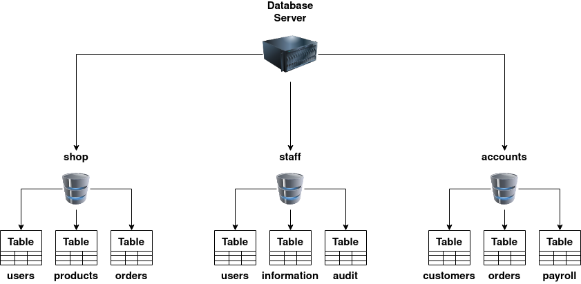
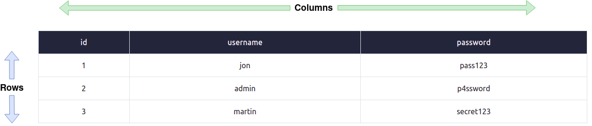

# 概述
SQL（结构化查询语言）注入，通常简称为SQLi，是对Web应用程序数据库服务器的攻击，导致执行恶意查询。当Web应用程序使用未经过适当验证的用户输入与数据库通信时，攻击者可能会窃取、删除或修改私密和客户数据，并攻击Web应用程序的身份验证方法以访问私人或客户区域。这就是为什么SQLi是最古老的Web应用程序漏洞之一，而且它也可能是最具破坏性的。

在这个学习模块中，你将了解数据库是什么，什么是SQL，并学习一些基本的SQL命令，如何检测SQL漏洞，如何利用SQLi漏洞，以及作为开发人员，如何保护自己免受SQL注入的攻击。
# 数据库基础知识

## SQL注入什么是数据库？
数据库是一种以有组织的方式电子存储数据集合的方法。数据库由一个称为数据库管理系统（DBMS）的控制。DBMS分为两类：关系型和非关系型；本教程将重点介绍关系型数据库；你可能会遇到的一些常见数据库有MySQL、Microsoft SQL Server、Access、PostgreSQL和SQLite。我们将在本任务末尾解释关系型和非关系型数据库之间的区别，但首先，了解一些术语非常重要。

在一个DBMS中，你可以有多个数据库，每个数据库包含自己的相关数据集。例如，你可能有一个名为"shop"的数据库。在这个数据库中，你想存储有关可购买的产品、已注册到你的在线商店的用户以及你收到的订单信息。你会使用一种称为表的东西将这些信息分别存储在数据库中。每个表都有一个唯一的名称。你可以在下面的图表中看到这种结构，但你也可以看到一个企业可能有其他单独的数据库来存储员工信息或会计团队的信息。

## 什么是表？
表由列和行组成；想象一张表格，列从左到右在顶部横向排列，包含单元格的名称，行从顶部到底部，每一行都包含实际数据。

### 列：
每个列，更好地称为字段，每个表有一个唯一的名称。在创建列时，你还要设置它将包含的数据类型，常见的数据类型有整数（数字）、字符串（标准文本）或日期。一些数据库可能包含更复杂的数据，如包含位置信息的地理空间数据。设置数据类型还确保不会存储不正确的信息，例如将字符串"hello world"存储在日期列中。如果发生这种情况，数据库服务器通常会生成一个错误消息。一个包含整数的列也可以启用自动递增功能；这为每一行数据赋予一个唯一的递增编号，随着每一行数据的增加而增加。这样做创建了一个称为主键的字段；主键字段对于每一行数据必须是唯一的，可以用于在SQL查询中找到该行。

### 行：
行或记录包含单独的数据行。当你向表中添加数据时，将创建一个新的行/记录；当你删除数据时，将删除一个行/记录。

## 关系型与非关系型数据库：
关系型数据库将信息存储在表中，并且通常，表之间共享信息；它们使用列来指定和定义正在存储的数据，行实际上存储数据。表通常包含一个具有唯一ID（主键）的列，然后在其他表中使用它来引用并在表之间创建关系，因此称为关系型数据库。

另一方面，非关系型数据库，有时称为NoSQL，是不使用表、列和行来存储数据的任何类型的数据库。不需要构建特定的数据库布局，因此每一行数据可以包含不同的信息，相对于关系型数据库具有更多的灵活性。一些这种类型的热门数据库有MongoDB、Cassandra和ElasticSearch。

现在你已经了解了什么是数据库，接下来让我们学习如何使用SQL与它交互。

# 什么是SQL？
SQL（Structured Query Language）是一种用于查询数据库的功能丰富的语言。这些SQL查询更好地被称为语句。

我们在本任务中要涵盖的最简单的命令用于检索（select）、更新、插入和删除数据。尽管有些相似，但一些数据库服务器有它们自己的语法和轻微的工作方式变化。所有这些示例都基于MySQL数据库。学完这些课程后，你将能够轻松地在网上搜索不同服务器的替代语法。值得注意的是，SQL语法不区分大小写。
